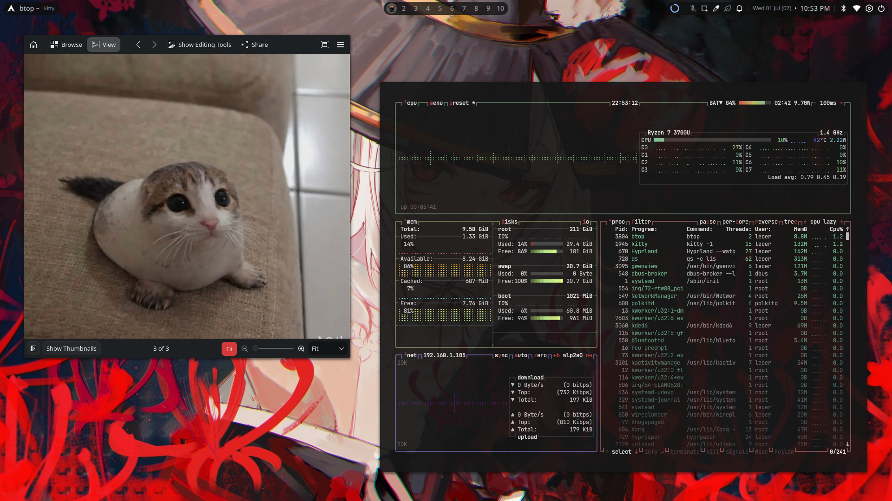
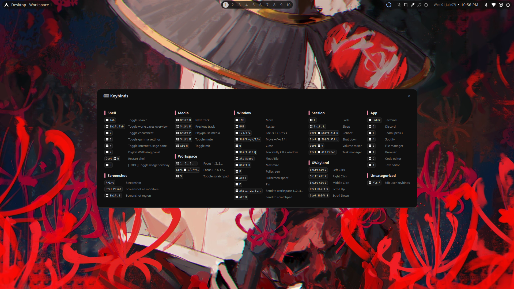
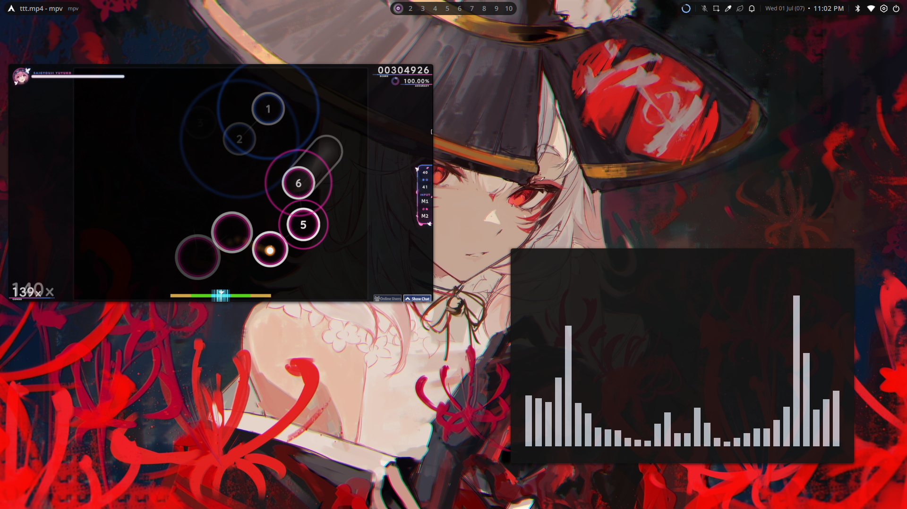
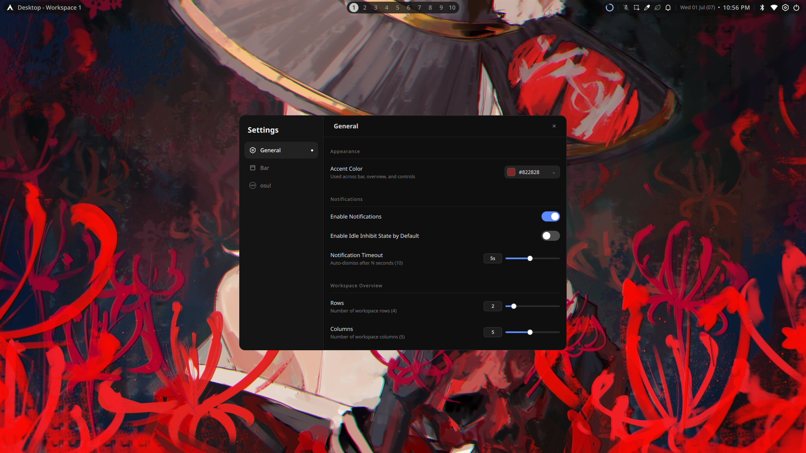

# Lecer's dots-hyprland

My personal Hyprland dotfiles using quickshell. (fast and lightweight)

> ## 🔴 THIS ONLY WORKS ON ARCH LINUX 🔴
> ### This setup is built exclusively for **Arch Linux** and will **NOT** work on any other distribution.

## Installation

```bash
git clone https://github.com/Lecer69/dots-hyprland.git
cd dots-hyprland
bash install.sh
```

Choose the **install** option from the menu.

## Updating

```bash
cd dots-hyprland
git stash && git pull && bash install.sh
```

Choose the **update** option from the menu.

## Screenshots

<p align="center">
  
  
  
  
</p>

## Thanks

- [Quickshell](https://quickshell.org/) — the toolkit that makes this whole shell possible
- [end-4's dots-hyprland](https://github.com/end-4/dots-hyprland) — inspiration for this setup
